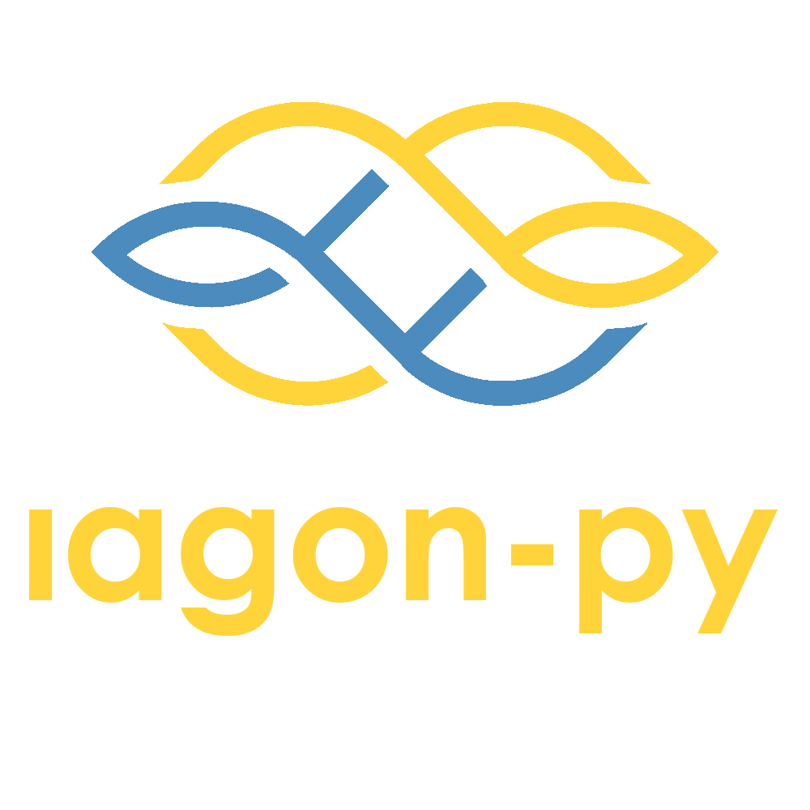

<div align="center">

  
  <p>
    A Python client for Iagon!
  </p>

<!-- Badges -->
<p>
  <a href="https://github.com/theeldermillenial/iagon-py/graphs/contributors">
    
  </a>
  <a href="">
    
  </a>
  <a href="https://github.com/theeldermillenial/iagon-py/network/members">
    
  </a>
  <a href="https://github.com/theeldermillenial/iagon-py/stargazers">
    
  </a>
  <a href="https://github.com/theeldermillenial/iagon-py/issues/">
    
  </a>
  <a href="https://github.com/theeldermillenial/iagon-py/blob/master/LICENSE">
    
  </a>
</p>

<h4>
    <a href="https://github.com/theeldermillenial/iagon-py">Documentation (Coming Soon!)</a>
  <span> · </span>
    <a href="https://github.com/theeldermillenial/iagon-py/issues/">Report Bug</a>
  <span> · </span>
    <a href="https://github.com/theeldermillenial/iagon-py/issues/">Request Feature</a>
  </h4>
</div>

`iagon-py` is a Python package for storing/accessing data on Iagon, a privacy focused
decentralized storage protocol on Cardano.

<!-- Table of Contents -->
<details>
  <summary>Table of Contents</summary>
  <ol>
    <li>
      <a href="#why-is-this-needed">Why?</a>
    </li>
    <li>
      <a href="#what-is-the-roadmap-for-this-project">Roadmap</a>
    </li>
    <li>
      <a href="#how-do-i-use-it">How To</a>
      <ul>
        <li><a href="#installation">Installation</a></li>
        <li><a href="#creating-folders-and-uploading-data">Download Public Data</a></li>
        <li><a href="#creating-folders-and-uploading-data">Creating Folders and Uploading Data</a></li>
      </ul>
    </li>
    <li><a href="#how-can-i-help">Contribute</a></li>
  </ol>
</details>

## Why is this needed?

Python is where a significant amount of data science is being done. Especially for
artificial intelligence and machine learning. Storage is a necessary component to data
driven decentralized applications, so making the first decentralized storage protocol
easily accessible to Python opens up a diverse set of integrations.

## What is the roadmap for this project?

The biggest driver of this tool right now is storing/loading deep neural networks and
the data needed to train them. Python has a storage abstraction package (`fsspec`) that
a number of Python tools use, including PyTorch (an AI framework) and a large body of
data ingestion and transformation tools. The current state of the package is that enough
of the direct API calls to Iagon are implemented to be able to create a virtual file
system for storing/loading PyTorch models and the data used to train them.

Once the virtual file system is created, the rest of the Iagon API will be implemented
followed by a more complete implementation of the virtual file system.

## How do I use it?

### Installation

You can install with `pip` from PyPI, but there is currently a bug in `pycardano` that
doesn't allow `CIP8` message signing with extended payment keys, so this will not work.
Instead, you will need to clone and install this repo:

```bash
pip install iagon-py
```

### Download public data

A common use case will be sharing public data directly from Iagon. `iagon-py` makes it
easy to pull in this data. We will use some clustering data generated for the Minswap
Catalyst Proposal Selection group for Catalyst Fund 10.

The Cardano Catalyst Fund 10 voting on Minswap used OpenAI and some custom clustering
methods to aggregate proposals into similar groups to summarize and filter them. This
data has been stored on Iagon, so this example will download them all. Some information
on how the groups were generated and clustered can be found
[on Twitter](https://x.com/ElderM/status/1702643308198060211?s=20).

Next, create a short script to pull in and store the compressed data.

```python
from pycardano import HDWallet

from iagon import IagonAdapter

# Give the file id of the Minswap Catalyst Grouping data
file_id = "65296cf4eba1933b118b368f"

# Create a random seed phrase to access Iagon
# Why is this needed? To access Iagon, we need to get an auth token using CIP8, which
# requires a wallet signature. Since it's public data, it doesn't matter what wallet we
# use, so generate a random one.
seed_phrase = HDWallet.generate_mnemonic()

# Create the Iagon session
with IagonAdapter.session(seed_phrase) as session:
    # Open a file to write the binary data to
    with open("minswap_catalyst_groups.zip", "wb") as fw:
        fw.write(session.download(file_id=file_id))

```

Now you can unzip the text files and see what the Minswap Catalyst Selection Group used.
The text files are randomly assigned a number indicating the cluster group number, with
a special group (`-1`) that acted as a catch all for proposals that didn't seem to fit
into any group.

### Creating Folders and Uploading Data

A good example of how to upload data will come, but it is currently possible to upload
data, create directories and subdirectories, and browse through data on Iagon.

For now, take a look at the code used to upload the Minswap Catalyst Selection Group
zip file: `examples\minswap_fund10_upload.py`.

Note that the code requires creating an `.env` file with a `SEED` value that corresponds
to the wallet you want to use to upload the data.

## How can I help?

I can always use volunteers to take on specific chunks of the project. I work on this
in my free time, along with some other Cardano projects. You can help by reaching out
on Twitter or Discord. Alternatively, sending tips is also helpful to cover the costs
of production. Tips can be sent to:

```bash
addr1q9hw8fuex09vr3rqwtn4fzh9qxjlzjzh8aww684ln0rv0cfu3f0de6qkmh7c7yysfz808978wwe6ll30wu8l3cgvgdjqa7egnl
```
